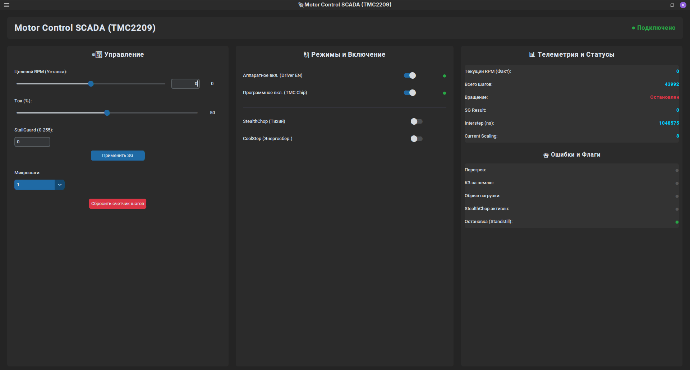
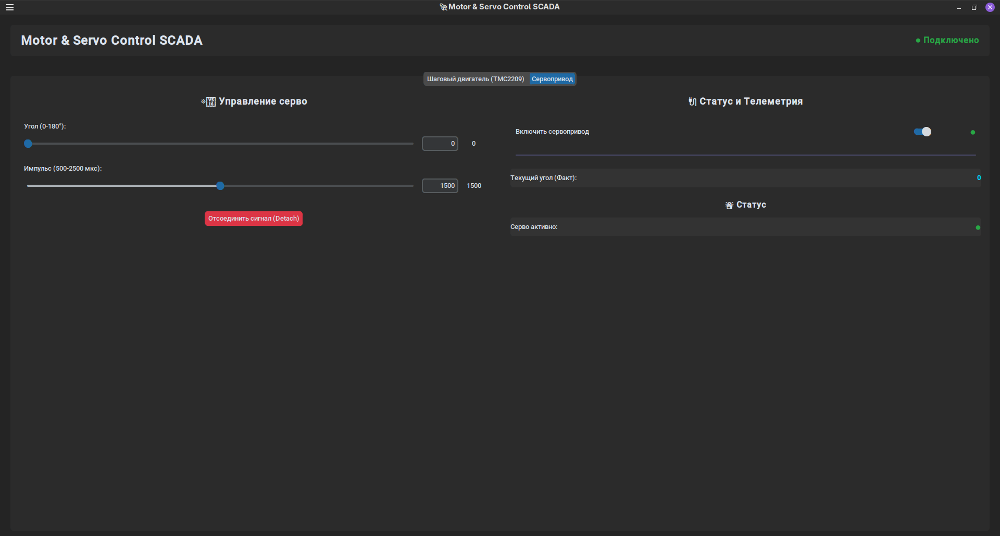

# Интерфейс управления

## Область Управления

`Целевой RPM` - Задается уставка скорости в диапозоне от -1000 до 1000 оборотов в минуту

`Ток` - Уставка тока в диапозоне 0 - 100%

`StallGuard` - 

`Микрошаг` - Уставка микрошага

`Сброс счетчика шагов` - Сброс счетчика шагов

## Область Режимы

`Аппаратное вкл. (Driver EN)` - Аппаратное Включение/Выключение драйвера tmc2209

`Программное вкл. (TMC Chip)` - Программное Включение/Выключение драйвера tmc2209

`StealthChop (Тихий)` - Включение/Выключение тихого режима работы шагового двигателя.

`CoolStep (Энергосбер.)` - Включение/Выключение энергосберегающего режима работы шагового двигателя.

## Область Телеметрия и Статусы

`Текущий RPM (Факт)`

`Всего шагов`

`Вращение`

`SG Result` - Для отслеживания нагрузки на вал или момента срыва шагов. Резкое падение значения sg_result при движении обычно означает столкновение или заклинивание механизма.

`Interstep (ns)`

`Current Scaling`

## Область Ошибки и Флаги

`Перегрев`

`КЗ на землю`

`Обрыв нагрузки`

`StealthChop активен`

`Остановка (Standstill)`

## Область Управление Серво

Тут можно задать угол сервопривода и отключить сервопривод

## Облать Статус и телеметрия

Вывод информации о сервоприводе включен или выключен. Так же выведен текущий угол.