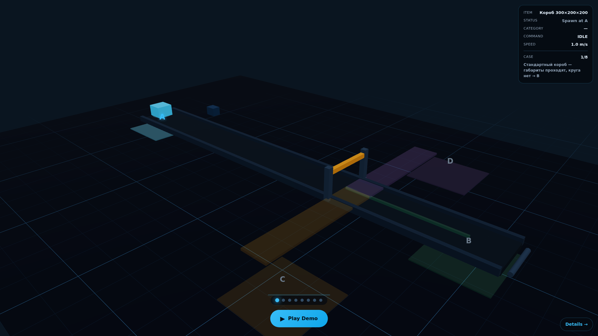
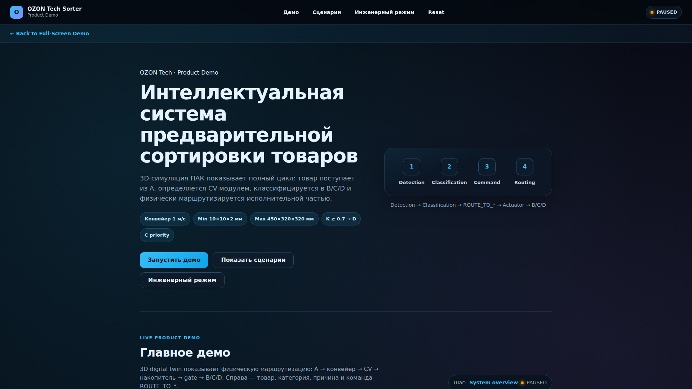

# Production Sync Report

**Date:** 2026-07-09  
**Status:** Resolved

---

## Root Cause

### Почему production не менялся:

1. **Docker контейнер не пересобран**
   - Контейнер `owl-web-1` был создан **4 дня назад** и не обновлялся
   - Все коммиты с MainPage, DetailsPage, routing были сделаны, но docker не пересобирался

2. **Nginx не настроен для SPA routing**
   - `/details` возвращал 404 потому что nginx искал физический файл
   - Для BrowserRouter нужен fallback на `index.html`

---

## What Was Fixed

### 1. Docker rebuild

```bash
docker compose -p owl -f docker-compose.server.yml up -d --build
```

### 2. Nginx SPA configuration

Создан файл `nginx.conf`:

```nginx
server {
    listen 80;
    server_name localhost;
    root /usr/share/nginx/html;
    index index.html;

    location / {
        try_files $uri $uri/ /index.html;
    }

    location /assets/ {
        expires 1y;
        add_header Cache-Control "public, immutable";
    }
}
```

### 3. Dockerfile update

```dockerfile
FROM nginx:alpine AS runtime
COPY --from=build /app/dist /usr/share/nginx/html
COPY nginx.conf /etc/nginx/conf.d/default.conf  # Added
EXPOSE 80
CMD ["nginx", "-g", "daemon off;"]
```

---

## Files Changed

| File | Change |
|------|--------|
| `nginx.conf` | Created (SPA fallback) |
| `Dockerfile` | Added nginx.conf copy |
| `scripts/test_production.py` | Created (browser QA) |

---

## Production Verification

### curl results

```
https://arhipovdan.ru/        → 200 OK
https://arhipovdan.ru/details → 200 OK
```

### Browser QA (production)

| Check | Result |
|-------|--------|
| Play button | ✓ |
| Details link | ✓ |
| HUD present | ✓ |
| Progress dots | 8 ✓ |
| HeroSection absent on / | ✓ |
| ProductDemo absent on / | ✓ |
| Header on /details | ✓ |
| HeroSection on /details | ✓ |
| No console errors | ✓ |

---

## Screenshots

```
docs/production_sync_screenshots/
├── prod_home_after_deploy.png
└── prod_details_after_deploy.png
```

### Main page (/)



- Full-screen 3D demo
- HUD: Item, Status, Category, Command, Speed, Case 1/8
- Play Demo button
- Details → link
- 8 progress dots

### Details page (/details)



- Back to Full-Screen Demo link
- Header with navigation
- HeroSection
- Detection/Classification/Command/Routing stepper
- Buttons: Запустить демо, Показать сценарии, Инженерный режим

---

## Build/Test Results

```
✓ npm run build — success
✓ npm run test — 59 tests passed
✓ docker rebuild — success
✓ curl / — 200
✓ curl /details — 200
✓ Browser QA — all checks passed
```

---

## Remaining Risks

1. **Browser cache** — Users may need to hard-refresh (Ctrl+Shift+R)
2. **CDN cache** — If using CDN, may need purge

---

## Commands for Commit/Push

```bash
cd /opt/arhipovdan/app

git add \
  nginx.conf \
  Dockerfile \
  scripts/test_production.py \
  docs/PRODUCTION_SYNC_REPORT.md \
  docs/production_sync_screenshots/

git commit -m "$(cat <<'EOF'
fix: add nginx SPA fallback for BrowserRouter routing

Root cause: Docker container was 4 days old and nginx had no
try_files fallback for SPA routes like /details.

Changes:
- Add nginx.conf with try_files $uri $uri/ /index.html
- Update Dockerfile to copy nginx config
- Add production browser QA script

Production verified:
- https://arhipovdan.ru/ shows full-screen 3D demo
- https://arhipovdan.ru/details shows detailed page
EOF
)"

git push origin dan_branch
```

**DO NOT RUN** — commit/push not requested.
