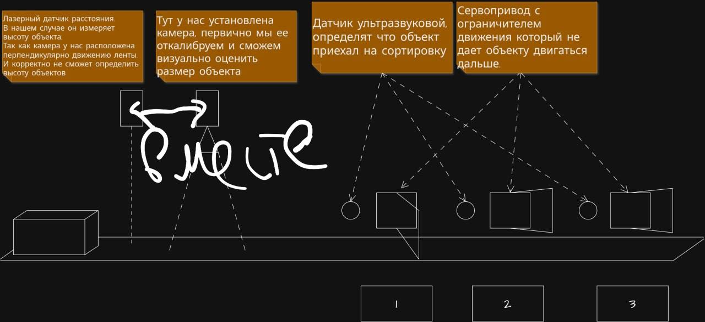

# Наброски будущей схемы конвейера

## Список материалов:

В этот список необходимо доложить энкодер для двигателя!

| Название | Сумма, ₽  | Количество |
| :--- | :--- | :--- |
| Медная лента для удаления припоя / Оплетка для выпайки диаметр 2 мм длина 1.5 м | 164 | 1 |
| Набор проводов для пайки | 855 | 1 |
| Флюс гель универсальный безотмывочный, для пайки микросхем и компонентов Flux RMA-223-UV-10г | 162 | 1 |
| Припой для пайки с канифолью 1мм 50гр ПОС-61 на катушке (ГОСТ) | 423 | 1 |
| ALIENTEK Паяльник 140 Вт, 7 предметов | 4 985 | 1 |
| Преобразователь DC-DC понижающий с 8-60V до 1-36V 15A max | 805 | 1 |
| Беспаечная макетная плата (breadboard) MB-102, 830 точек, для Arduino и прочих устройств | 1 112 | 2 |
| 120 шт. Провода перемычки для макетных плат, соединительные провода для модулей, контроллеров arduino (10 см) 3 вида по 40 шт папа-папа, мама-мама, папа-мама | 636 | 2 |
| Homeled, Блок питания, 12V, 200W, 180-265 вольт. С клеммами. Импульсный для светодиодных лент и светильников | 599 | 1 |
| Сервопривод MG996R, 10 шт, 180 , металлические шестерни, для Arduino, роботов и RC, размеры стандарт | 2 990 | 1 |
| PWM PCA9685 драйвер на 16 сервоприводов расширитель портов с I2C интерфейсом для Led и Servo (12 bit, I2C) в IIC/I2C/TWI/SPI c тестером сервоприводов 3 режима, набор | 1 178 | 2 |
| Модуль I2C-мультиплексора CJMCU-9548 на базе TCA9548A / PCA9548A | 532 | 2 |
| Модуль VL53L0X лазерный дальномер GY-530 (до 2м, питание 3-5В, I2C) | 1064 | 4 |
| Модуль ESP32 TYPE-C CH340C + плата расширения ESP32 | 1040 | 2 | 

[Ссылка на товары](https://www.ozon.ru/cart?share=wGhPkQd)
