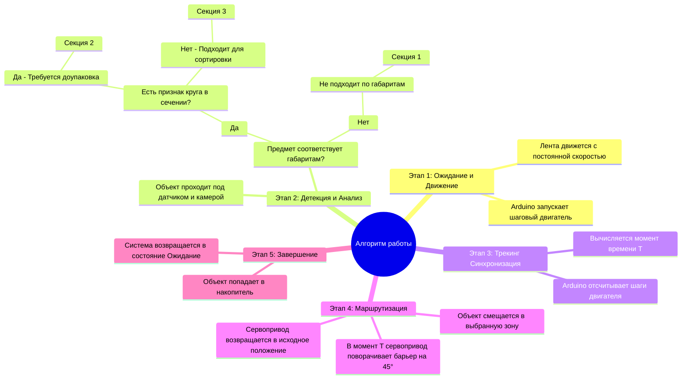
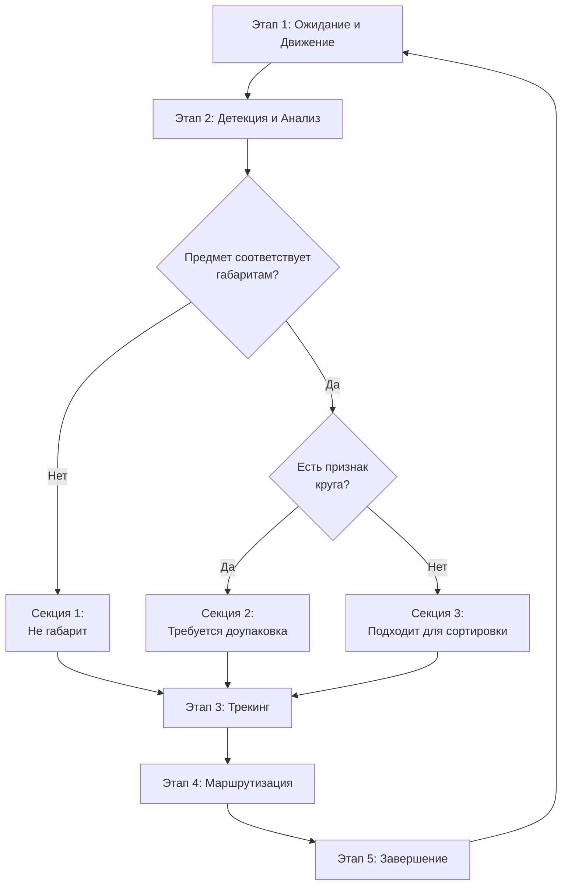

# Алгоритм работы сортировщика

```mermaid
mindmap
  root((Алгоритм работы))
    Этап 1: Ожидание и Движение
      Arduino запускает шаговый двигатель
      Лента движется с постоянной скоростью
    Этап 2: Детекция и Анализ
      Объект проходит под датчиком и камерой
      Предмет соответствует габаритам?
        Да
          Есть признак круга в сечении?
            Да - Требуется доупаковка
              Секция 2
            Нет - Подходит для сортировки
              Секция 3
        Нет
          Не подходит по габаритам
            Секция 1
    Этап 3: Трекинг Синхронизация
      Arduino отсчитывает шаги двигателя
      Вычисляется момент времени T
    Этап 4: Маршрутизация
      В момент T сервопривод поворачивает барьер на 45°
      Объект смещается в выбранную зону
      Сервопривод возвращается в исходное положение
    Этап 5: Завершение
      Объект попадает в накопитель
      Система возвращается в состояние Ожидание
```

## Блок схема:

```mermaid
flowchart TD
    Start[Этап 1: Ожидание и Движение] --> Detect[Этап 2: Детекция и Анализ]
    Detect --> SizeCheck{Предмет соответствует<br/>габаритам?}
    
    SizeCheck -->|Нет| Reject[Секция 1:<br/>Не габарит]
    SizeCheck -->|Да| CircleCheck{Есть признак<br/>круга?}
    
    CircleCheck -->|Да| Repack[Секция 2:<br/>Требуется доупаковка]
    CircleCheck -->|Нет| Sort[Секция 3:<br/>Подходит для сортировки]
    
    Reject --> Track[Этап 3: Трекинг]
    Repack --> Track
    Sort --> Track
    
    Track --> Route[Этап 4: Маршрутизация]
    Route --> End[Этап 5: Завершение]
    End --> Start
```